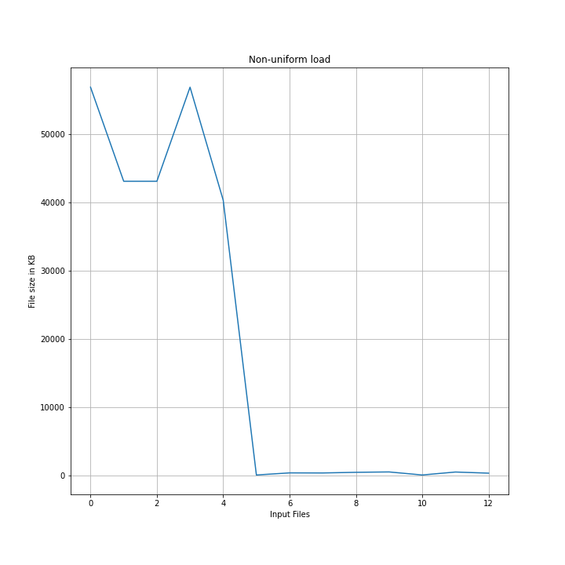
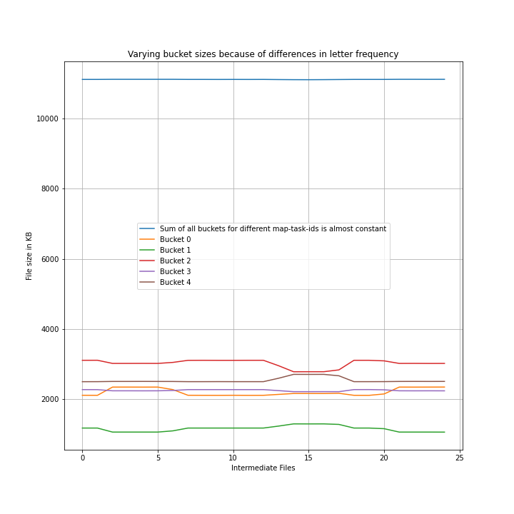

# Map-reduce


GRPC in Python has been used for server-client communication. The driver splits the whole work into chunks of almost equal size while respecting word boundaries. The metadata of these chunks need to be passed to the workers. This metadata includes file indices of the sorted input file list, seek pointer and size of the chunk to read from each file.

To run driver.py:

```console
foo@bar:~$ python driver.py 6 4 
```
where 6 and 4 are values of N (number of map tasks) and M (number of reduce tasks) respectively.

worker.py and test.py don't need any command-line arguments to run.

## Tokenizer

The tokenizer is implemented in a very simple manner. Text is converted to lowercase, and everything other than alphabets is used as word boundaries. More sophisticated tokenizers can be used (for ex. from Spacy's trained pipelines, but haven't been used to stay in the scope of in-built python modules).

## Testing

Testing is done by calculating frequencies of words directly by iterating through all the input files and checking if the frequencies for every word match with those obtained from map-reduce.

## Work Distribution by driver

Another alternative could have been to just distribute files among the workers, but then a non uniform input load could have slowed down the entire process. In our implementation, as can be seen in the figures below, the map tasks are of almost equal size. The buckets created are of different sizes because of differing letter frequencies.




## Threading
Communication between the driver and the workers is through multiple threads (but can be limited to a single thread as well by setting args.MAX_WORKERS = 1 in the driver.py main() function). Write access to shared variables is maintained through a lock. Also, the workers need to wait for the reduce tasks until all the map tasks have been completed. This has been implemented using Event() from the in-built threading module. Suppose there are three threads and five workers. It can happen that all the three worker threads are waiting. And the other two worker threads can't notify the driver that their map tasks have completed because all threads are occupied. This condition has also been taken care of in the code.